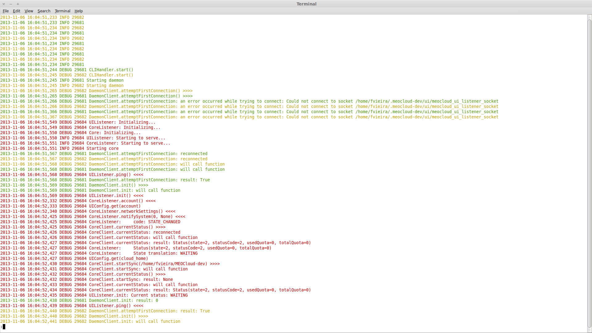

# Log Analyser #

Given a list of regexes, does the equivalent of grepping the log using those regexes, but colorizes the resulting lines differently for each regex, increasing readability.

Example:
`$ log_analyser app.log 29684 29681 29682`

